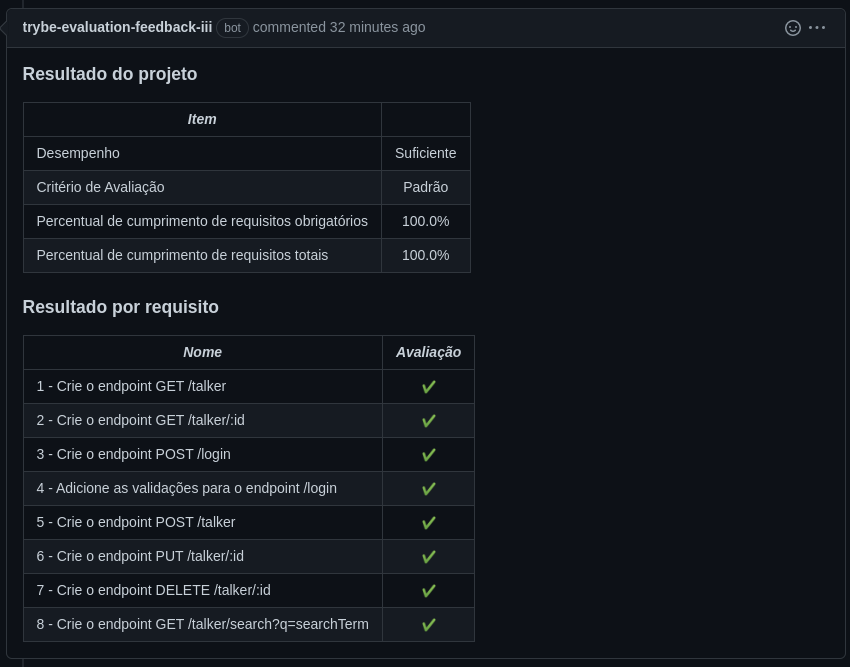

# Português 🇧🇷🇵🇹

<details>
  <summary>
    Saiba mais
  </summary>
  
  # Talker Manager
Projeto da [Trybe](https://www.betrybe.com/) - Bloco 22 - API para gestão de palestrantes feita em Node.js.

## 💻 Projeto

Aplicação de cadastro de talkers (palestrantes) em que é possível cadastrar, visualizar, pesquisar, editar e excluir informações.

<details>
  <summary><strong>🏆 Meu desempenho</strong></summary><br />

  
</details>


## 🚀 Tecnologias
> Este projeto foi desenvolvido com:

- Node JS
- Docker
- Docker Compose
- Insomnia

## 📌 Habilidades
> Habilidades desenvolvidas:

- Desenvolver uma API de um CRUD (Create, Read, Update e Delete)
- Desenvolver endpoints para ler e escrever em um arquivo utilizando o módulo fs.


## 🐋 Executando o Docker Compose

```bash
docker-compose up -d
docker exec -it talker_manager bash
```

## ⬇️ Instalando dependências

```bash
npm install
``` 

## 🧪 Executando Testes

```bash
npm run dev
npm test
```
  
## Time de desenvolvimento
> Projeto individual:
  

## 💬 Contatos

<div align="center" style="display: inline_block">
  <a href="https://rabeloguedes.github.io" target="_blank">
    
  </a> 
  <a href="https://www.linkedin.com/in/al%C3%AA-emmanuel-rabelo-guedes/" target="_blank">
    
  </a> 
   <a href="mailto:rabeloguedes@proton.me">
     
  </a>
</div>

</details>

# English 🇺🇸🇬🇧

<details>
  <summary>
    More
  </summary>
  
  # Talker Manager
Project from [Trybe](https://www.betrybe.com/) - Block 22 - API for talker management made in Node.js.

## 💻 Project

Application of talker (speakers) registration where it is possible to register, view, search, edit and delete information.

<details>
  <summary><strong>🏆 My accomplishment</strong></summary><br />

  
</details>


## 🚀 Technologies
> This project was developed with:

- Node JS
- Docker
- Docker Compose
- Insomnia

## 📌 Skills
> Practiced skills:

- Develop an API of a CRUD (Create, Read, Update and Delete)
- Develop endpoints to read and write in a file using the module fs.

## 🐋 Executing the Docker Compose

```bash
docker-compose up -d
docker exec -it talker_manager bash
```

 ## ⬇️ Install dependencies

```bash
npm install
``` 

## 🧪 Executing tests

```bash
npm run dev
npm test
```

## Squad
> Single Person Project:
  

## 💬 Contact

<div align="center" style="display: inline_block">
  <a href="https://rabeloguedes.github.io" target="_blank">
    
  </a> 
  <a href="https://www.linkedin.com/in/al%C3%AA-emmanuel-rabelo-guedes/" target="_blank">
    
  </a> 
   <a href="mailto:rabeloguedes@proton.me">
     
  </a>
</div>

</details>

# Deutsch 🇩🇪

<details>
  <summary>
    Mehr
  </summary>
  
  # Talker Manager
Projekt von [Trybe](https://www.betrybe.com/) - Blocke 22 - API für die Verwaltung von Talkern gemacht in Node.js.

## 💻 Projekt

Aplikation für die Registrierung von Talkern (Sprechern) in der es möglich ist, registrieren, anzeigen, suchen, bearbeiten und löschen von Informationen.

<details>
  <summary><strong>🏆 Meine Leistung</strong></summary><br />

  
</details>

## 🚀 Technologies
> Dieses Projekt wurde mit den entsprechenden Technologies hergestellt:

- Node JS
- Docker
- Docker Compose
- Insomnia

## 📌 Fähigkeiten
> Ausgeübte Fähigkeiten:

- Entwickeln einer API für einen CRUD (Create, Read, Update und Delete)
- Entwickeln von Endpunkten zum Lesen und Schreiben in einer Datei mit Hilfe des Moduls fs.

## 🐋 Ausführen des Docker Composes

```bash
docker-compose up -d
docker exec -it talker_manager bash
```

## ⬇️ Installieren dependencies

```bash
npm install
``` 

## 🧪 Ausführen Tests

```bash
npm run dev
npm test
```

## Entwickungsteam
> Einer Person Projekt:
  

## 💬 Kontakt

<div align="center" style="display: inline_block">
  <a href="https://rabeloguedes.github.io" target="_blank">
    
  </a> 
  <a href="https://www.linkedin.com/in/al%C3%AA-emmanuel-rabelo-guedes/" target="_blank">
    
  </a> 
   <a href="mailto:rabeloguedes@proton.me">
     
  </a>
</div>

</details>
